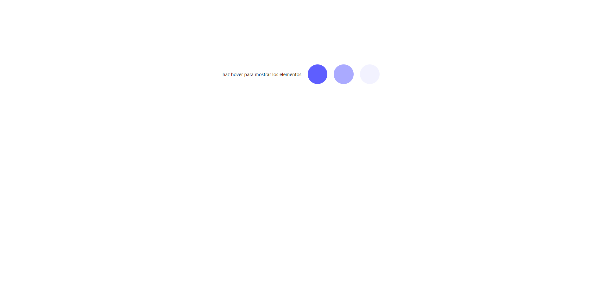
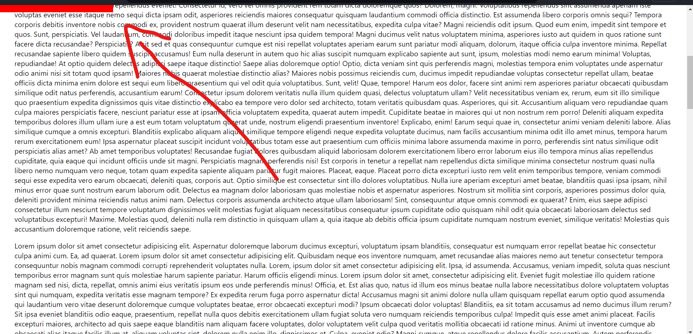
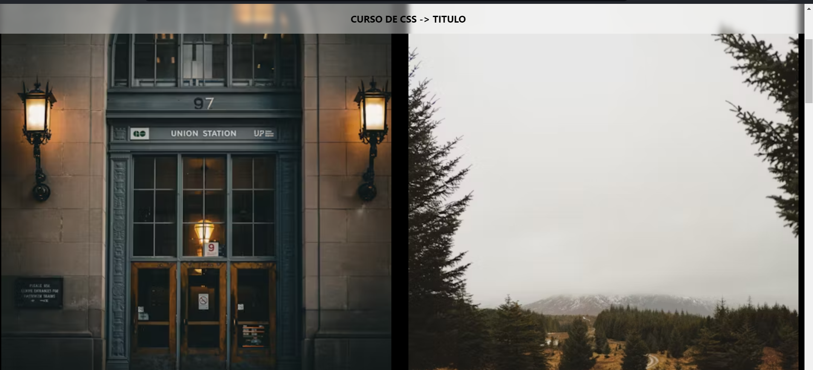

## CARGA-3P

> [!NOTE]
> Al hacer hover, cargan 3 puntos

--

## CIRCULO-HOV

> [!NOTE]
> Circulo transiciones con keyframes

--

## SCROLL-LIN

> [!NOTE]
> Al hacer scroll se carga una línea arriba = progress row

--

## TITULO-ANI

> [!NOTE]
> Al hacer scroll el titulo hace efecto sticky(no fixed) y van apareciendo las imágenes
